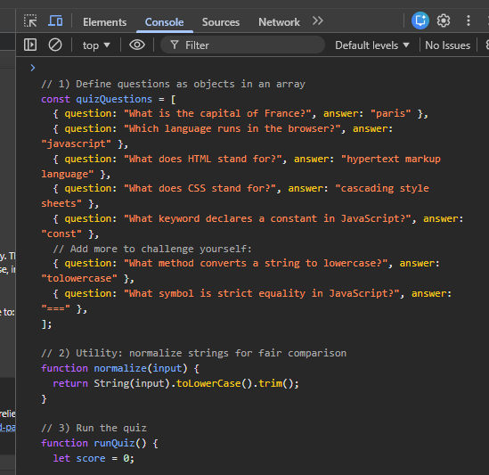
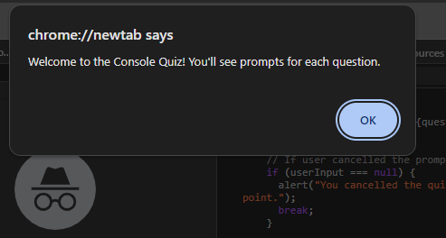
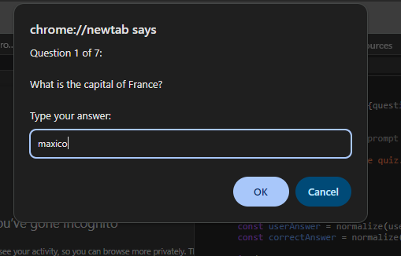
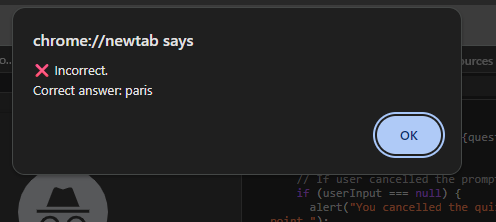
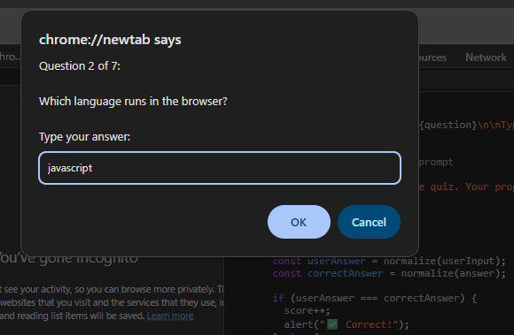
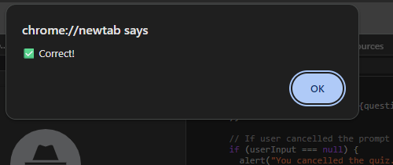
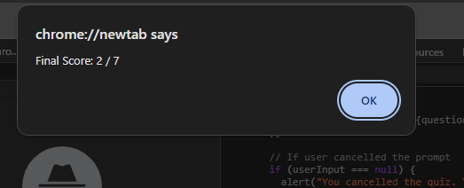

- Name: Anuj Deshwal
- Roll No: 2501227008
- Course: BCA
- Semester: 1st
- Subject: WebDev-1

# Console Quiz (JavaScript)

A simple quiz game that runs entirely via the browser console using `prompt()` and `alert()`.

## OUTPUT

## How to run
1. **Open** a modern browser (Chrome, Firefox, Edge).
2. **Open DevTools** (Right-click → Inspect → Console).
3. **Paste** the contents of `quiz.js` into the console.
4. **Start** the quiz by running:

## Features
- **Predefined questions:** Stored in an array of objects
- **Input normalization:** Uses `toLowerCase()` and `trim()` for fair comparison
- **Immediate feedback:** Alerts for correct/incorrect answers
- **Score tracking:** Final score displayed at the end

## Submission checklist
- **quiz.js** pushed to GitHub
- **README.md** included
- **At least 5 questions** and working score display
- **Share the GitHub link** with faculty

## Optional improvements
- **Multiple choice** options
- **Per-question timer**
- **Hints** for incorrect answers
- **High scores** via `localStorage`
- **Restart** option and score-based messages

